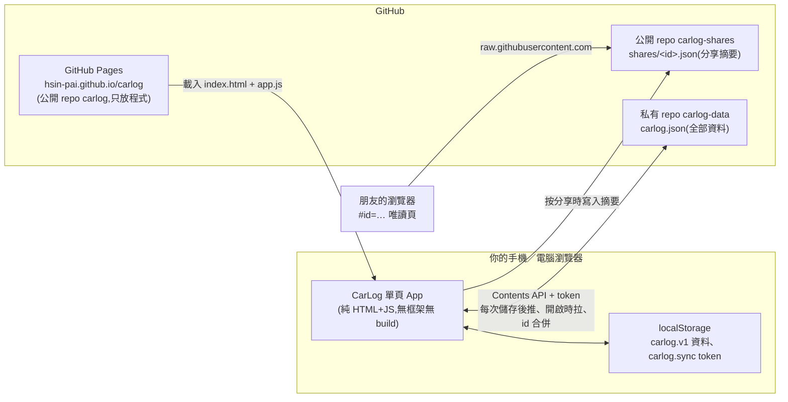
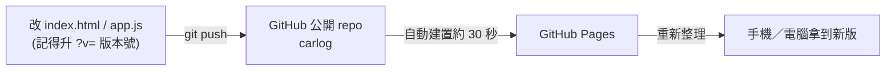
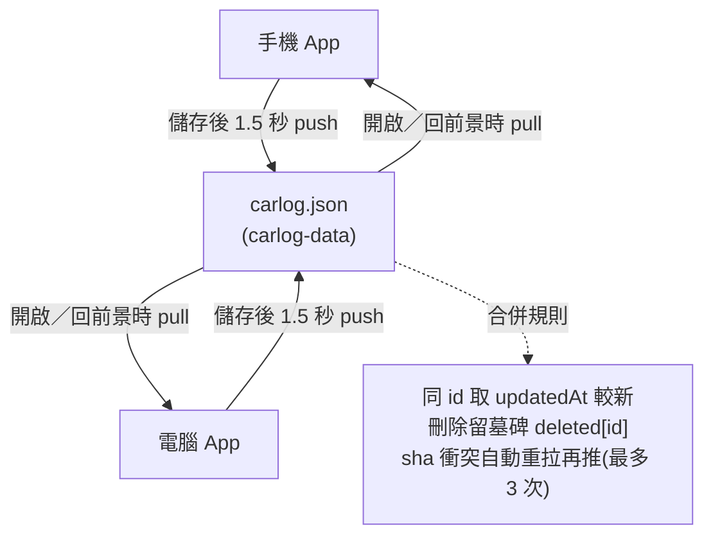

# 🚗 CarLog 持有成本

記錄愛車每一筆花費,算出「**每日持有成本**」的單頁工具。純靜態 HTML + JS,資料存在瀏覽器 localStorage,零後端零成本。
手機加到主畫面就是一個 App(有 PWA manifest 與圖示)。

## 核心指標:每日持有成本

```
每日持有成本 = 累計支出 ÷ 持有天數(從交車日起算,含當天)
```

持有越久每天越便宜,首頁主視覺就是這條遞減曲線。可切換兩種口徑:

- **含車價**:所有支出都算
- **不含車價**(純營運):排除「車價」分類,看養車本身的成本

刻意不用「每公里成本」當主指標,因為那會逼人每次都記里程。里程改用「偶爾抄一次里程表」的快照,兩點之間線性內插;不記也不影響其他功能。

## 系統架構

### App 執行架構



沒有任何自建伺服器。瀏覽器直接呼叫 GitHub API,token 只存在裝置上。

### 程式更新流程



### 多裝置同步與合併



Claude 也可以直接改 `carlog-data` 的 `carlog.json`(例如幫忙從單據照片建立支出),App 下次開啟就會合併進來。

## 功能

| 頁面 | 內容 |
|---|---|
| 總覽 | 每日持有成本 + 遞減曲線(30 天 / 90 天 / 1 年 / 全部)、本月支出、每月平均、每公里成本(有里程快照才顯示)、最近支出、里程快照 |
| 記帳 | 支出列表(依月份分組)、依類型篩選、點一筆可編輯/刪除 |
| 統計 | 近 12 個月長條圖、分類圓餅(本月 / 今年 / 全部)、一次性 / 固定 / 變動 小計 |
| 設定 | 車款、交車日、交車里程、里程快照管理、JSON 匯出 / 匯入、清除資料 |

右下角 **+** 新增支出;記「充電」時多兩格「度數(kWh)」與「每度單價」,金額/度數/單價填任兩個自動算第三個,單價會記住上次的(家充通常固定,之後只填度數即可)。

## 分享給朋友

總覽右上「分享」→ 選含車價 / 不含車價 → 手機會跳系統分享選單(LINE 等),電腦則複製連結。
朋友點開看到唯讀摘要頁:每日持有成本、遞減曲線、三類型小計、分類占比、每月支出。

- **短連結(預設)**:摘要存到公開 repo `HSIN-PAI/carlog-shares` 的 `shares/<id>.json`,連結長 `#id=<id>`,LINE 貼得下。
  需要 token 的 Repository access 同時勾 `carlog-data` 和 `carlog-shares`。id 是摘要內容的雜湊,同一份快照只會產生一個檔
- **長連結(退路)**:存不上去(沒連線、token 沒權限)就把摘要用 deflate 壓縮後放在網址 `#z=…`,不經過任何伺服器;
  LINE 對太長的網址只會把前半段變成連結,所以能用短連結就用短連結
- 只帶彙總:分類合計、有支出的月份合計、曲線取樣 60 點;**單筆明細與備註不會出去**
- 連結是分享當下的快照,之後記的新資料不會更新到舊連結,要再分享一次;不想再讓某個連結被看到,把 `carlog-shares` 裡對應的檔刪掉即可

## 支出分類

- **一次性**:車價、領牌/規費、充電樁、配件
- **固定週期**:保險、牌照稅/燃料費
- **變動**:充電、保養/維修、停車、過路費、洗車、罰單、其他

## 專案結構

| 檔案 | 用途 |
|---|---|
| `index.html` | 頁面骨架與樣式(深色主題、行動優先) |
| `app.js` | 全部邏輯:狀態與 localStorage、每日成本序列、里程內插、SVG 圖表(手刻,無外部套件)、GitHub 同步 |
| `manifest.json`、`icon-*.png`、`apple-touch-icon.png` | 加到主畫面用 |

資料格式(localStorage key `carlog.v1`):

```json
{
  "version": 1,
  "car": { "name": "Tesla Model Y", "deliveryDate": "2026-09-05", "deliveryOdo": 8 },
  "settings": { "includePrice": true, "chartWindow": "all", "statsPeriod": "all" },
  "expenses": [ { "id": "…", "date": "2026-09-12", "category": "charging", "amount": 420, "note": "超充 台中", "kwh": 38.5 } ],
  "odometer": [ { "id": "…", "date": "2026-09-15", "km": 410 } ]
}
```

「設定 → 匯出 JSON」就是這個物件。換手機前先匯出,新手機匯入即可。

## 雲端同步(GitHub 私有 repo)

只存手機沒安全感,所以 App 可以把資料自動存到你 GitHub 的**私有 repo**(本專案用 `HSIN-PAI/carlog-data`,裡面只有一個 `carlog.json`)。
每次記帳都是一個 commit,GitHub 的版本歷史就是備份;多裝置開啟會自動拉回並合併。沒有後端,是瀏覽器直接呼叫 GitHub API。

### 設定步驟

1. GitHub 建一個**私有** repo(例如 `carlog-data`),放一個內容為 `{}` 的 `carlog.json`(或直接讓 App 建立也可以)
2. 產生 token:GitHub 右上頭像 → **Settings** → 左側最下方 **Developer settings** → **Personal access tokens** → **Fine-grained tokens** → **Generate new token**
   - Token name:隨便,例如 `carlog`
   - Expiration:選最長(到期後 App 會顯示「token 無效或已過期」,再產生一把貼上即可)
   - Repository access:**Only select repositories** → 勾 `carlog-data`(資料)和 `carlog-shares`(分享短連結,公開 repo)
   - Permissions → Repository permissions → **Contents:Read and write**(其他都不用)
   - Generate,把 `github_pat_…` 複製起來(只會顯示一次)
3. 打開 App → **設定 → 雲端同步** → 填 repo(`帳號/carlog-data`)與 token → **連線並同步**
4. 每一台裝置都做一次第 3 步(同一把 token 可以重複用)

token 只存在該裝置的 localStorage;因為它只能讀寫那一個私有 repo,外洩的最壞情況是車子花費紀錄被看到或改掉,不會影響你其他 repo。

### 合併規則

- 支出與里程各有 `id` 與 `updatedAt`,兩邊聯集、同 id 取較新的
- 刪除會留「墓碑」(`deleted[id] = 刪除時間`),別台裝置的舊資料不會讓它復活
- 車輛資料取 `meta.updatedAt` 較新的一邊;「含車價 / 圖表窗口 / 統計期間」這類純介面偏好不同步
- 推送時若雲端已被別台裝置更新(sha 不符),自動重拉、合併、再推,最多三次
- 時機:每次儲存後 1.5 秒、App 回到前景時、網路恢復時;失敗會在「設定」顯示原因,下次儲存再試

## 自動記帳入口:`inbox/`(給 iOS 捷徑等外部程式用)

想讓別的程式幫忙記一筆,**不用動 `carlog.json`**,只要在 `carlog-data` 的 `inbox/` 資料夾新增一個 JSON 檔,
App 下次同步時會把它轉成支出並刪掉檔案。支出 id 由檔名決定,多台裝置同時處理也不會重複。

檔案內容(欄位都是選填,只有 `amount` 必填):

```json
{ "amount": 123.4, "kwh": 45.2, "category": "charging", "date": "2026-10-07", "note": "家充 自動記帳" }
```

- `category` 預設 `charging`;其他值見「支出分類」的 id(`accessory`、`parking`…)
- `date` 格式 `YYYY-MM-DD`,省略就用 App 處理當天
- 用 GitHub Contents API 建檔(同一把 token):`PUT /repos/HSIN-PAI/carlog-data/contents/inbox/<檔名>.json`,
  body 是 `{"message":"…","content":"<標準 base64 的 JSON>","branch":"main"}`;檔名建議用時間 `yyyyMMdd-HHmmss`
- 格式不對(例如 `amount` 不是數字)的檔會被跳過並留在 inbox 讓你檢查

### iOS 27 捷徑:LINE 充電完成通知 → 自動記帳

社區充電樁的 LINE 通知長這樣(每段一個費率,度數要加總,金額抓「總計」):

```
充電扣款:
充電費用 使用 充電樁 'PCAB4-2-T-CK2-096':
 1. 10/05 22:46 ~ 10/05 23:59 0.029度 * 6.47 元 = 1 元,
 2. 10/06 00:00 ~ 10/06 05:59 12.171度 * 3.53 元 = 43 元,
  總計: 45 元 ,
剩餘儲值金額 $4958 元.
```

**前置**:LINE 設定 → 通知 → 「顯示訊息內容」要開,通知裡才有文字可解析。

**建立自動化**:捷徑 App → 自動化 → 新增 → 選「收到通知時」→ App 選 **LINE** → 內容「包含」填 `充電扣款` →
「立即執行」打開(不要選執行前先詢問)→ 下一步 → 新增空白捷徑,依序加入以下動作:

| # | 動作(搜尋這個名稱) | 設定 |
|---|---|---|
| 1 | **比對文字** | 文字:魔法變數「捷徑輸入」→ 選 **內文**;模式 `([0-9.]+)度` |
| 2 | **從比對的文字取得群組** | 群組索引 **1** |
| 3 | **計算統計資料** | **總和**,輸入用上一步結果 → 這是度數 |
| 4 | **比對文字** | 文字:同樣「捷徑輸入 › 內文」;模式 `總計:\s*([0-9]+)` |
| 5 | **從比對的文字取得群組** | 群組索引 **1** → 這是金額 |
| 6 | **格式化日期** | 日期「目前日期」,格式 **自訂**,填 `yyyy-MM-dd` |
| 7 | **格式化日期** | 日期「目前日期」,自訂格式 `yyyyMMdd-HHmmss` → 當檔名 |
| 8 | **字典** | `amount` = 動作 5 的結果、`kwh` = 動作 3 的結果、`category` = `charging`、`date` = 動作 6 的結果、`note` = `社區充電樁 自動記帳` |
| 9 | **文字** | 內容放動作 8 的字典(會自動變成 JSON 文字) |
| 10 | **Base64 編碼** | 輸入動作 9;換行選 **無** |
| 11 | **字典** | `message` = `inbox 自動記帳`、`content` = 動作 10 的結果、`branch` = `main` |
| 12 | **取得 URL 內容** | URL:`https://api.github.com/repos/HSIN-PAI/carlog-data/contents/inbox/` 後面接動作 7 的結果再接 `.json`;方法 **PUT**;標頭 `Authorization` = `Bearer <你的 token>`、`Accept` = `application/vnd.github+json`;請求內文 **JSON**,內容用動作 11 的字典 |

token 就是 App「設定 → 雲端同步 → 複製 token」那一把。存好後,下次充電完通知一跳出來,幾秒內 `carlog-data/inbox/` 就會多一個檔;
手機或電腦 App 下次開啟時會顯示「已從 inbox 記入 1 筆」。要測試不用等充電:在 LINE 把那則通知轉傳給自己,通知一樣會觸發。

若通知被 LINE 截斷導致找不到「總計」,動作 5 會是空的,App 會把該檔留在 inbox 不記帳;這時改用「= ([0-9]+) 元」加總當退路。

## 改完程式要做的事

`index.html` 裡 `<script src="app.js?v=…">` 的版本號和 `app.js` 開頭的 `VERSION` 一起升,不然 GitHub Pages 的快取會讓使用者拿到新 HTML 配舊 JS。

## 本機預覽

任何靜態伺服器都行,例如:

```bash
npx --yes http-server . -p 8124 -c-1
```

## 部署到 GitHub Pages

1. 在 GitHub 建一個 repo(公開私有皆可,Pages 公開 repo 免費)
2. 推上去:`git remote add origin <repo url>` → `git push -u origin main`
3. repo 的 **Settings → Pages → Build and deployment**:Source 選 *Deploy from a branch*,Branch 選 `main` / `(root)`,Save
4. 一兩分鐘後網址會出現在同一頁,手機 Safari 開啟 → 分享 → **加入主畫面**

## 未來可能加的

- 油車比較(v0.1 做過,PAI 覺得沒有比較依據,v0.3 拿掉;需要的話從 git 歷史找回)

- 預估殘值 / 折舊(目前只記實際支出)
- 固定週期支出到期提醒(保險、稅金)
- 多台車
